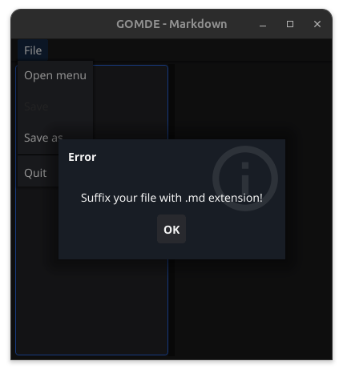
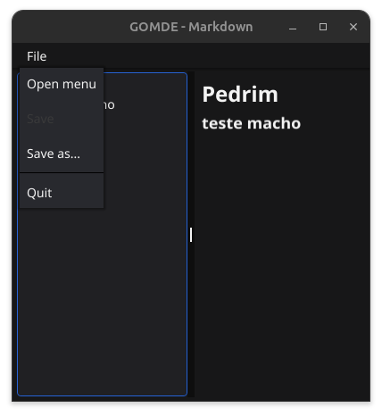

#  GOmde (Go Markdown Editor) is a really simple markdown editor made with Golang and Fyne

Status: wip 

This version: This project is open-source but; just made for fun to play with Golang; personal; 

Working on:
- Publish BTN -> direct to GIT
- Rich Text Visual Editor

I gonna use this to write my posts together with [marmite](https://github.com/rochacbruno/marmite)

# How to use 

> Unzip GOmde.tar.xz file 
> Execute ./usr/local/bin/gomde 

# Build with Fyne 

You should have Golang in your Path. 

> fyne package -appVersion 1.0.1 -name GOmde -release -icon icon.png

*First version that I see of app like this was built in a workshop by Trevor Sawler;
