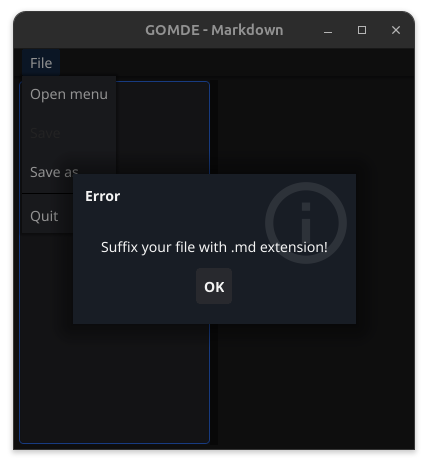
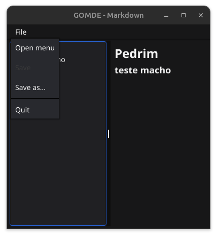

#  [wip] gomde (Go Markdown Editor) is a really simple markdown editor made with Golang and Fyne

Version 1: Was built in a workshop by Trevor Sawler; 
This version: I built on top of Trevor's versions, this project is open-source; just made for fun :)

I gonna use it to work together with [marmite](https://github.com/rochacbruno/marmite)

